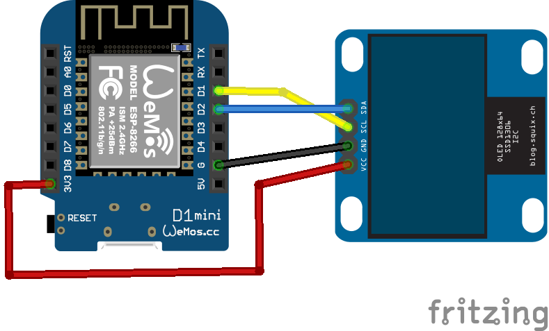
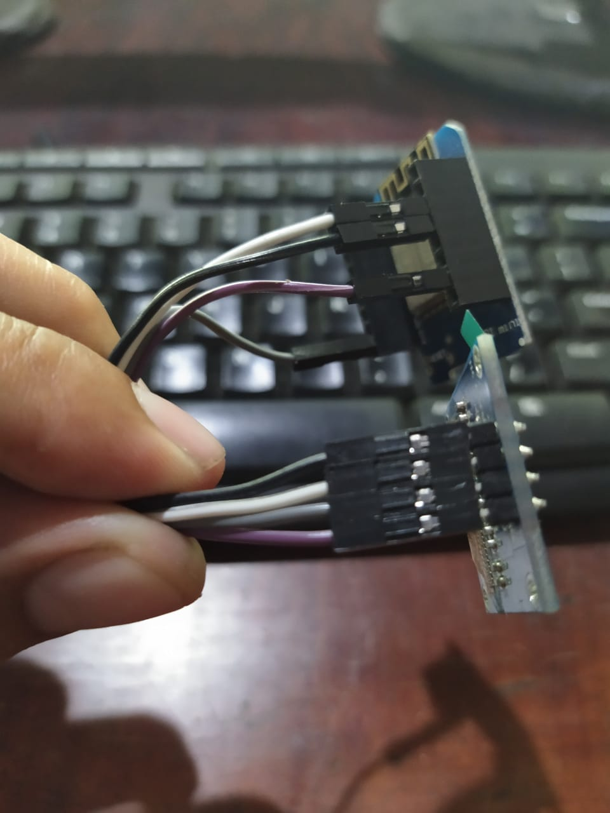
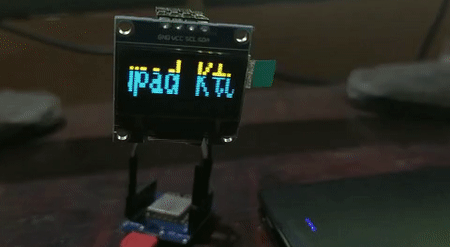

# Aplikasi OLED
Wemos D1 Mini / ESP 8266, Oled I2C  
Ktupad MVC Framework  
Demo: http://oled-ktupad.gearhostpreview.com/  

## Import Aplikasi
1. Clone https://github.com/ktupad/oled.git
2. Beri nama oledapp atau nama yang tersedia, lalu klik Begin Import

## Koneksi Cloud
1. Login ke https://my.gearhost.com/account/login
2. Add Cloud, pilih nama oledapp atau nama yang tersedia, pilih Free, lalu Create Cloudsite
3. Pilih Cloud, klik Publish, klik Github, lalu Authorize, klik Repository, lalu klik Activate.

## Create Database
1. login ke https://my.gearhost.com/Databases, lalu Create Database,
pilih nama oledapp atau nama yag tersedia,
pilih Mysql Free, Lalu klik Create Empty Database,
2. Salin server, username, password dan nama database.

## Koneksi Database
1. login ke https://github.com,
2. Pilih oledapp, lalu edit app.php, isikan server, username, password dan nama database dari gear host.
lalu klik Commit Changes
3. Pilih oledapp, lalu edit app.js ,isikan conf.host dengan alamat gearhost,
contoh: http://oledapp.gearhostpreview.com/
lalu klik commit changes.

## Install Database
1. http://oledapp.gearhostpreview.com/app.php?mod=install
2. Jalankan aplikasi http://oledapp.gearhostpreview.com/

## Upload IoT
1. Download dan edit oled-ktupad.ino
2. Edit ssid dan pass
3. Edit host menjadi http://oledapp.gearhostpreview.com/app.php?iot&mod=read&id=1
4. Upload kedalam board.

Done.  

  
  

